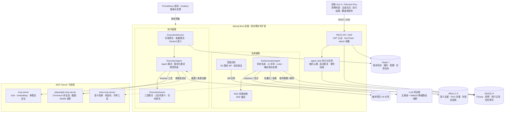

# AICaseTest — AI 驱动的测试用例生成系统

     

基于代码分析 + 状态机提取 + LLM 的智能测试用例生成平台：自动分析 Spring Boot / Vue 项目，提取 API 端点与业务状态机，按"本期范围"生成结构化、**AI 可执行**的测试用例，由 Playwright 驱动真实浏览器执行并产出截图 / WebM 录屏 / HTML 报告，形成「分析 → 范围 → 生成 → 执行 → 回归」完整闭环。

## 核心能力

- **代码分析**：扫描 Spring Boot 后端（Controller/Entity/Enum/业务规则）与 Vue 前端，提取端点、表单、校验规则、DOM 选择器与页面路由，附证据与告警可解释
- **状态机提取**：LLM 推断 + 源码赋值点证据校验（verified/unverified 标注），覆盖率不建立在编造之上
- **本期范围（Scope）**：Git 基线 diff 自动识别本次迭代变更的接口/页面，分析完成自动锁定范围，生成只聚焦本期
- **用例生成**：PRD 驱动 + RAG 多路检索，分模块流式生成结构化用例（步骤含 action/target/expected，全 UI 人话化话术），评审 + Linter + 确定性后处理三道质量闸
- **自动执行**：Playwright MCP 真实浏览器，Agent 模式（多模态定位 + LLM 决策）与程序化模式（结构化 uiSelector）双轨；hash 路由感知导航、三层断言（URL/标题 → DOM 文本 → 诚实 skipped）
- **覆盖率与报告**：状态转换 / 接口覆盖率双口径、未覆盖接口清单、执行结果截图/录屏/HTML 报告全证据链
- **语义层**：Milvus 语义去重、生成前 RAG 上下文注入、自然语言语义搜索、失败经验库
- **工程化**：MySQL/Redis/Milvus 全栈、任务持久化与租约恢复、LLM 熔断与多供应商降级、Prometheus 指标 + Grafana 看板告警、双实例水平扩容

## 架构总览



## 技术栈

| 层 | 技术 |
|----|------|
| 后端 | Java 17、Spring Boot 3.4、Spring Data JPA、Spring Security/JWT、Spring AI 1.0（OpenAI starter） |
| 数据层 | MySQL 8（Flyway 管理）/ H2（开发 profile） |
| 运行态 | Redis 7（取消标志/心跳/并发配额/防爆破/任务队列） |
| 语义层 | Milvus 2.4 + LLM Embedding（语义去重/RAG/搜索/失败经验库） |
| 前端 | Vue 3、Vite、Element Plus、Pinia、ECharts、markmap |
| AI/执行 | Spring AI 承载 LLM 调用；MCP 桥接 Playwright 浏览器执行与多模态视觉定位（详见 [docs/spring-ai-migration.md](docs/spring-ai-migration.md)） |
| 部署 | Docker、docker-compose（MySQL + Redis + Milvus + Grafana） |

## 快速开始

### 环境要求

- JDK 17+、Node.js 18+、Maven 3.8+
- 生产全栈需 Docker（MySQL / Redis / Milvus）

### 配置（必需）

```bash
cp .env.example .env
```

编辑 `.env` 至少填入以下变量——**任何 profile 下四把安全密钥缺失任一项后端拒绝启动**（本地开发允许弱值，生产另有强度校验）：

```
APP_JWT_SECRET=...
APP_ADMIN_PASSWORD=...        # admin 初始密码，首次登录强制修改
MILVUS_PASSWORD=...
MCP_BRIDGE_TOKEN=...
LLM_API_KEY=...               # Agent 模式执行与生成必需
LLM_BASE_URL=... / LLM_MODEL=...
```

其余可选项（连接池、RAG、限流、执行超时等）见 [.env.example](.env.example) 内注释。

### Docker 一键启动（推荐）

```bash
docker compose up -d
```

依次启动 MySQL（宿主端口 3308）、Redis、Milvus、后端（8000，内置 Chromium 可直接执行）与前端（Nginx，80/443）。部署前可用 `docker compose config --quiet` 自查密钥是否齐全。

### 本地开发

```bash
cd backend && mvn spring-boot:run -Dmaven.repo.local=../.m2-repo   # http://localhost:8000
cd frontend && npm install && npm run dev                          # http://localhost:5173
```

启动后访问前端，使用 `admin` + `APP_ADMIN_PASSWORD` 登录（首次登录强制改密），或注册新账号。

## 用例执行

1. 测试用例页选择用例 →「执行 / 批量执行」，填入待测页面 URL
2. 选模式：**Agent 模式**（LLM 多模态识别 + DOM 兜底，推荐）或**程序化模式**（按结构化 uiSelector 直接操作）
3. 执行历史 / 执行结果页查看步骤、截图、WebM 录屏、HTML 报告与证据文件

要点：单批上限 100 条（超限报 50014）；用例需含结构化步骤，纯自然语言步骤在程序化模式下跳过；多实例部署需将 `outputs/` 配置为共享卷（证据文件在实例本地）；本地裸跑首次需 `cd playwright-mcp-server && npx playwright install chromium`。

## 测试与运维

- 后端 542 个单元/集成测试（含 Testcontainers MySQL/Redis）+ JaCoCo 门禁；前端 Vitest 10 例 + 覆盖率阈值
- 回归入口 `scripts/verify-v5-stack.ps1`；安全自查 `scripts/security-check.ps1`；备份 `scripts/backup-v5.ps1`
- 可观测：`/actuator/health`、`/actuator/prometheus` + Grafana 看板与告警；运维手册见 [docs/运维手册.md](docs/运维手册.md)

## 项目结构

```
AICaseTest/
├── backend/                  # Spring Boot 后端
│   └── src/main/java/com/testagent/
│       ├── analyzer/         # 代码分析器（Spring/Vue 扫描）
│       ├── agent/            # AI 用例生成/状态机/执行 Agent
│       ├── controller/       # REST API
│       ├── service/          # 业务服务
│       ├── entity/ dto/ repository/   # JPA 实体与数据访问
│       ├── security/ runtime/ queue/  # JWT 认证/Redis 运行态/任务队列
│       └── migration/        # H2 → MySQL 迁移工具
├── frontend/                 # Vue 3 前端（views/components/stores/api）
├── mcp-server/               # LLM MCP Server（chat / embedding / 多模态定位）
├── tools-mcp-server/         # 语义检索/需求解析/状态机/评审工具 MCP
├── playwright-mcp-server/    # Playwright MCP Server（浏览器操作 + 录屏）
├── scripts/                  # 验证/备份/安全自查/压测脚本
├── docs/                     # 版本三件套（PRD+前后端评审）/CHANGELOG/运维手册/API
└── docker-compose.yml
```

## 文档

每个功能版本在 `docs/vX.Y.Z/` 维护**三件套**（PRD + 后端技术评审 + 前端技术评审），最新：

- [v9.7](docs/v9.7/) 批量执行失败修正 · [v9.6](docs/v9.6/) 评审质量检查与选择器作用域 · [v9.3](docs/v9.3/) litemall 实测回归修复

其它：[CHANGELOG](docs/CHANGELOG.md) · [迭代历程](docs/迭代历程.md) · [API 概览](docs/API概览.md) · [运维手册](docs/运维手册.md) · [水平扩容指南](docs/水平扩容指南.md) · [容量基线报告](docs/容量基线报告.md) · [长期迭代计划书](docs/长期迭代计划书.md)

## 版本

当前 **v9.7**：批量执行失败修正（断言空白归一 / 手势硬拒绝 / 假选择器真实池校验 / 22 条用例修正）。近期版本：

- v9.7 批量执行失败修正（17 失败根因落地：断言锚点、假选择器、数据态、Agent 点击）
- v9.6 评审质量检查与选择器作用域（ReviewQualityChecker 语义重复/预期一致性、选择器路由作用域）
- v9.5 执行失败归因优化 + 选择器池扩充 + 数据依赖治理（12.16/12.17）
- v9.3 litemall 实测回归修复（断言占位符元描述剔除 / 编号模块归组重编 / 面包屑口径）

## 版本线总览（v1.0 → v9.7）

| 版本线 | 主题 | 状态 |
|---|---|---|
| v1.x | 结构化用例、PRD 驱动、前端代码分析 | ✅ 完成 |
| v2.x | Skill/MCP、Playwright 执行、录屏报告 | ✅ 完成 |
| v3.x | 流式生成、执行闭环、统计回归、平台化 | ✅ 完成 |
| v4.x | 账号安全、并发治理、项目组权限、分析流式化 | ✅ 完成 |
| v5.x | 数据层与平台底座（MySQL/Flyway、Redis 运行态、Milvus 语义检索、数据治理、MCP 工具化与 Skill 化） | ✅ 完成 |
| v6.x | Spring AI 迁移与高可用（Agentic RAG/任务持久化/租约恢复/熔断降级/事件总线/timeline 回放） | ✅ 完成 |
| v7.x | 全链路可信与闭环（执行可信/转换证据校验/三层断言/缓存基线/评审闭环/双编号制） | ✅ 完成 |
| v8.x | 本期范围聚焦与安全一致性可观测（Scope/密钥清零/向量对账/出参契约/指标看板/多供应商降级/双实例） | ✅ 完成 |
| v8.9.x | 上线加固与实测驱动（凭据清零/连接池与限流/水平扩容/压测基线/litemall 实测修复） | ✅ 完成 |
| v9.x | litemall 实测深化（范围全自动/生成与 SSE 解耦/用例人话化/断言与执行器修复/评审质量检查/选择器作用域） | ✅ 完成 |
| vT1–vT9 | 测试与运维基线（单测/集成/前端/安全/回归收口） | ✅ 完成 |
| vP1–vP5 | 上线加固（TLS/容灾/可观测/发布流水线/压测容量） | ✅ 完成 |

> v8.9 平台化方向（多租户/协作/OpenAPI/录制编排 CI）按计划书"阶段 5 整体可裁剪"条款裁剪，方向保留待立项。

逐版本详细变更见 [docs/CHANGELOG.md](docs/CHANGELOG.md) 与 [docs/迭代历程.md](docs/迭代历程.md)。

## API 文档

REST API 概览见 [docs/API概览.md](docs/API概览.md)；后端运行时 Swagger：`/swagger-ui/index.html`。

## License

MIT
