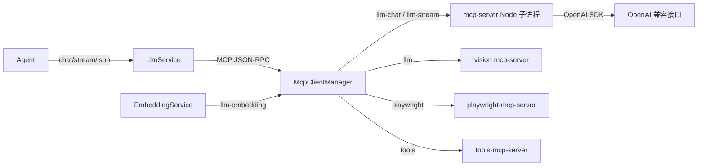
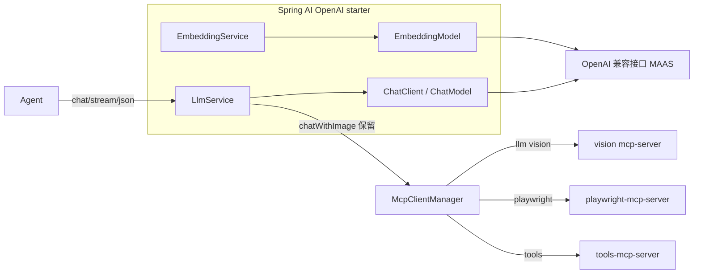

# AICaseTest Spring AI 混合重构（保留 MCP）

## 目标

把 AICaseTest 的 LLM 文本 / 流式 / JSON / Embedding 层从「MCP 子进程 + OpenAI SDK」迁移到 Spring AI（主线 `spring-ai-starter-model-openai`），同时严格保留 MCP 的浏览器、工具、多模态能力。主分支在重构期间保持可部署。

## 分支

- 重构分支：`codex/refactor-spring-ai`
- 主线依赖：`org.springframework.ai:spring-ai-starter-model-openai` 1.0.0
- PoC 对比依赖：`com.alibaba.cloud.ai:spring-ai-alibaba-starter-dashscope` 1.0.0.4（单独 PoC 分支，禁止与 OpenAI starter 同时启用）

## 重构前调用链路



## 重构后调用链路



## 主要改动

1. `backend/pom.xml`：Spring Boot `3.2.5 -> 3.4.5`；引入 `spring-ai-bom` + `spring-ai-starter-model-openai`。
2. `application.yml` / `application-prod.yml`：新增 `spring.ai.openai.*` 映射，并覆盖 `completions-path=/chat/completions`、`embeddings-path=/embeddings` 规避 `/v1/v1` 404。
3. `LlmService`：`chat` / `chatWithAnalysis` / `chatJson` 走 `ChatClient`；`chatStreaming` 走 `ChatClient.stream()`（Flux 仅在类内适配）；`isConfigured` 改查 `ChatModel`；新增 `cancelStreaming()`；保留重试、遥测与 MCP `chatWithImage`。
4. `EmbeddingService`：改为 `EmbeddingModel`，新增 `getDimensions()`。
5. `McpClientManager`：不再拉起 `llm-chat` / `llm-stream` / `llm-embedding`，保留 `llm`(vision)、`playwright`、`tools`。
6. `TestCaseService`：`cancelGeneration()` 同时调用 `llmService.cancelStreaming()`。
7. 测试：修复 `PrdAgentTest` / `StateMachineAgentTest` 的 mock 方法；新增 `LlmServiceTest`、`EmbeddingServiceTest`。

## 配置映射

| 环境变量 | Spring AI 属性 |
| --- | --- |
| `LLM_API_KEY` | `spring.ai.openai.api-key` |
| `LLM_BASE_URL` | `spring.ai.openai.base-url` |
| `LLM_MODEL` | `spring.ai.openai.chat.options.model` |
| `LLM_EMBEDDING_MODEL` | `spring.ai.openai.embedding.options.model` |

`LLM_BASE_URL` 同时继续喂给 MCP vision 子进程。

## OpenAI starter 与 Alibaba DashScope starter PoC 对比

| 维度 | `spring-ai-starter-model-openai` | `spring-ai-alibaba-starter-dashscope` |
| --- | --- | --- |
| Spring Boot 兼容 | 3.4.5 | 1.0.0.4 依赖 3.4.8（可与 3.4.x 共用） |
| DashScope 兼容端点 | 支持（需覆盖 `completions-path` / `embeddings-path` 规避 `/v1/v1`） | 原生支持 DashScope 协议 |
| `enable_thinking` 透传 | 不支持（`ChatCompletionRequest` 为固定 record） | 原生支持（`DashScopeChatOptions`） |
| 多模态 | 需额外图片 PoC | 原生支持 |
| 结论 | 主线默认，功能可用；思考开关为咨询性配置 | 若必须按任务开合 `enable_thinking`，建议切换 PoC 分支 |

`enable_thinking` 无法经 OpenAI starter 透传（已通过反射核验 `ChatCompletionRequest` 字段），因此 `llm.thinking.*` 在该链路为咨询性配置。这是两条路线对比的核心差异。

## 验证结果记录

已完成：

- `mvn verify` BUILD SUCCESS，JaCoCo 门禁通过，测试全绿。
- `npm run build` 构建成功。
- `docker compose config` 校验通过。
- 全仓库无 `qwen3.7-max-2026-05-20` 残留。
- `/api/health` 返回 `UP`。
- 真实 LLM：Spring AI 调用 `qwen3.7-max` 返回 200，`/api/settings/test-llm` 响应 `ok`。
- 真实流式：`LlmStreamingIntegrationTest`（`AICT_LIVE_LLM_TEST=true` 开启）验证 `chatStreaming` 真实收到分块，返回完整文本并回传 usage（`LlmStreamingIntegrationTest` 正常 `mvn test` 默认跳过）。
- 真实 embedding：Spring AI `EmbeddingModel` + `qwen3.7-text-embedding` 返回 1024 维向量。
- 真实生成 SSE：为 PRD 项目触发 `GET /api/projects/{id}/testcases/generate-stream`，Spring AI 流式 + `StreamingTestCaseParser` 成功推送多条 `case` 事件并以 `complete(total=7)` 结束。

待部署环境验证（MySQL/Redis/Milvus + Playwright + 前端 + 带 PRD 项目）：

- 用例生成后由 Playwright 自动执行并输出截图 / 录屏 / 报告（执行段仍需浏览器 MCP 与可用被测应用）；
- `enable_thinking` 开关在 OpenAI starter 链路下的影响评估。

## 迁移命令

```bash
mvn -s maven-settings.xml -f backend/pom.xml verify
npm --prefix frontend run build
docker compose up -d
curl http://localhost:8000/api/health
```

## 停止条件结论

- Spring AI 与 MAAS 兼容端点不兼容：未触发（chat 200、embedding 1024 已对齐）。
- embedding 维度不是 1024：未触发（确认为 1024）。
- `StreamingTestCaseParser` 误判 / 丢用例：未触发（解析器不变，仅上游 chunk 来源改 Spring AI 流）。
- Spring Boot 升级后测试大面积失败：未触发（仅修复 2 个既有测试的 mock 方法用错，非升级导致）。
